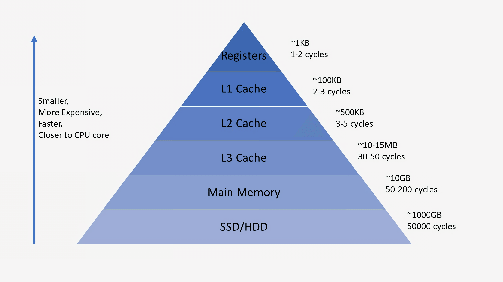
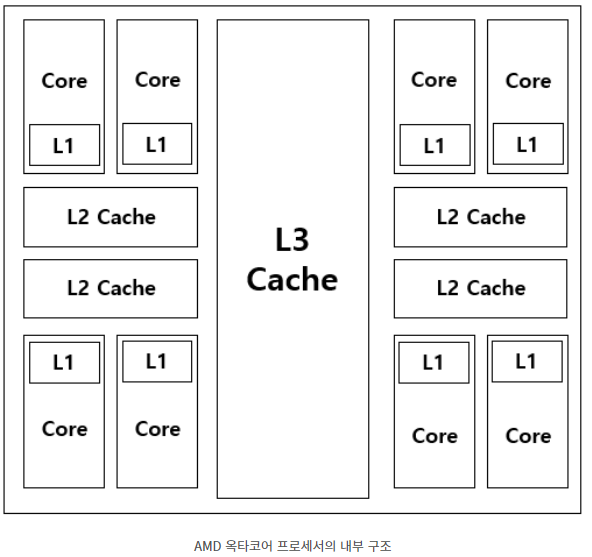

#  캐시 메모리(Cache Memory)

------


`cpu`

- `core`
  - cpu 안에서 물리적 연산을 담당
- `thread`
  - 운영체제 (os)에서 인식하고 작동하는 작업단위 
    - 코어 1, thread1 ->2 
    - 코어 개수를 늘리지 않고 cpu성능 향상시킴

- `클럭`
  - 코어 하나당 일의 처리 속도
    - 발열이나 다른 문제로 인해, 코어수가 작을때, 클럭수가 조금 더 높음

- `cache`

  - cpu 안에 고속메모리

  - 자주 사용하는 데이터나 값을 미리 복사해 놓는 임시 장소를 가리킨다. 

  - CPU가 주기억장치에서 저장된 데이터를 읽어올 때, 자주 사용하는 데이터를 캐시 메모리에 저장한 뒤, 다음에 이용할 때 주기억장치가 아닌 캐시 메모리에서 먼저 가져오면서 속도를 향상시킨다.

  - 아래와 같은 저장공간 계층 구조에서 확인할 수 있듯이, 캐시는 저장 공간이 작고 비용이 비싼 대신 빠른 성능을 제공한다. 

    

  - 속도가 빠른 장치와 느린 장치에서 속도 차이에 따른 병목 현상을 줄이기 위한 메모리를 말한다.

    - CPU코어와 메모리 사이의 병목현상 완화

    - 상대적으로 빠른 cpu 속도 ---> 상대적으로 느린 시스템 메모리로 넘어갈 때 

      수용하기 힘든 속도로 정보가 몰려서

      병목 현상이 일어남 (4차선->1차선) (차막히듯이)

      캐시메모리: 점차적으로 줄어들게 해주는 중간역할 !

## cpu에서의 cache



- 캐시메모리
  - 속도와 크기에 따라 분류한 것으로, 일반적으로 L1 캐시부터 먼저 사용된다. 
  - (CPU에서 가장 빠르게 접근하고, 여기서 데이터를 찾지 못하면 L2로 감)


***듀얼 코어 프로세서의 캐시 메모리*** : 각 코어마다 독립된 L1 캐시 메모리를 가지고, 두 코어가 공유하는 L2 캐시 메모리가 내장됨

만약 L1 캐시가 128kb면, 64/64로 나누어 64kb에 명령어를 처리하기 직전의 명령어를 임시 저장하고, 나머지 64kb에는 실행 후 명령어를 임시저장한다. (명령어 세트로 구성, I-Cache - D-Cache)

- L1 : CPU 내부에 존재
- L2 : CPU와 RAM 사이에 존재
- L3 : 보통 메인보드에 존재한다고 함

> 캐시 메모리 크기가 작은 이유는, SRAM 가격이 매우 비쌈


***디스크 캐시*** : 주기억장치(RAM)와 보조기억장치(하드디스크) 사이에 존재하는 캐시


### 캐시 메모리 작동 원리

>원본 데이터(System-of-Record)와는 별개로 자주 쓰이는 데이터(Hot Data)들을 복사해둘 캐시 공간 을 마련한다. 캐시 공간은 상수 시간[ ] 등 낮은 시간 복잡도로 접근 가능한 곳을 주로 사용한다.
>
>데이터를 달라는 요청이 들어오면, 원본 데이터가 담긴 곳에 접근하기 전에 먼저 캐시 내부부터 찾는다.

- #### 시간 지역성- temporal locality

  for나 while 같은 반복문에 사용하는 조건 변수처럼 한번 참조된 데이터는 잠시후 또 참조될 가능성이 높음

  (최근에 접근된 데이터)

- #### 공간 지역성 - spatial locality

  A[0], A[1]과 같은 연속 접근 시, 참조된 데이터 근처에 있는 데이터가 잠시후 또 사용될 가능성이 높음
  
  캐시에 데이터를 저장할 때는, 이러한 참조 지역성(공간)을 최대한 활용하기 위해 해당 데이터뿐만 아니라, 옆 주소의 데이터도 같이 가져와 미래에 쓰일 것을 대비한다.
  
  ​	(최근에 접근된 데이터의 주변 데이터)

- **sequential locality - 순차 지역성**

   array[0], array[1], ....array[2]에 접근할 확률이 높은것을 분류


---

---

CPU가 요청한 데이터가 캐시에 있으면 'Cache Hit', 없어서 DRAM에서 가져오면 'Cache Miss'

### 캐시 미스 경우 3가지

1. #### Cold miss

   해당 메모리 주소를 처음 불러서 나는 미스

   즉, 원하는 데이터가 캐시에 없음

2. #### Conflict miss

   캐시 메모리에 A와 B 데이터를 저장해야 하는데, A와 B가 같은 캐시 메모리 주소에 할당되어 있어서 나는 미스 (direct mapped cache에서 많이 발생)

   ```text
   항상 핸드폰과 열쇠를 오른쪽 주머니에 넣고 다니는데, 잠깐 친구가 준 물건을 받느라 손에 들고 있던 핸드폰을 가방에 넣었음. 그 이후 핸드폰을 찾으려 오른쪽 주머니에서 찾는데 없는 상황
   ```

3. #### Capacity miss

   캐시 메모리의 공간이 부족해서 나는 미스 (Conflict는 주소 할당 문제, Capacity는 공간 문제)

​		캐시 **크기를 키워서 문제를 해결하려하면, 캐시 접근속도가 느려지고 파워를 많이 먹는 단점**이 생김


4. expiration

   오래되어 최신성을 잃은 캐시

5. cache hit

   원하는 데이터가 있으면, 원본 데이터가 있는 공간에 접근하지 않고, 캐시에서 바로 해당 데이터를 제공한다.

6. eviction

   캐시 공간이 작아서, 공간이 모자라면 안쓰는 데이터부터 삭제하여 공간을 확보함


### 구조 및 작동 방식

- #### Direct Mapped Cache

  가장 기본적인 구조로, DRAM의 여러 주소가 캐시 메모리의 한 주소에 대응되는 다대일 방식

  현재 그림에서는 메모리 공간이 32개(00000~11111)이고, 캐시 메모리 공간은 8개(000~111)인 상황

  ex) 00000, 01000, 10000, 11000인 메모리 주소는 000 캐시 메모리 주소에 맵핑

  이때 000이 '인덱스 필드', 인덱스 제외한 앞의 나머지(00, 01, 10, 11)를 '태그 필드'라고 한다.

  이처럼 캐시메모리는 `인덱스 필드 + 태그 필드 + 데이터 필드`로 구성된다.

  간단하고 빠른 장점이 있지만, **Conflict Miss가 발생하는 것이 단점**이다. 위 사진처럼 같은 색깔의 데이터를 동시에 사용해야 할 때 발생한다.

- #### Fully Associative Cache

  비어있는 캐시 메모리가 있으면, 마음대로 주소를 저장하는 방식

  저장할 때는 매우 간단하지만, 찾을 때가 문제

  조건이나 규칙이 없어서 특정 캐시 Set 안에 있는 모든 블럭을 한번에 찾아 원하는 데이터가 있는지 검색해야 한다. CAM이라는 특수한 메모리 구조를 사용해야하지만 가격이 매우 비싸다.

- #### Set Associative Cache

  Direct + Fully 방식이다. 특정 행을 지정하고, 그 행안의 어떤 열이든 비어있을 때 저장하는 방식이다. Direct에 비해 검색 속도는 느리지만, 저장이 빠르고 Fully에 비해 저장이 느린 대신 검색이 빠른 중간형이다.

  > 실제로 위 두가지보다 나중에 나온 방식


---


```python
#웹 캐시
네트워크를 통해 데이터를 가져오는 것은 하드디스크보다도 느릴 때가 많다.

cpu(file실행), memory(명령어 _ ㅁ), disk(file)
웹서버 <--url------브라우저 (클라이언트가 접속)
(응답)--html, img-->브라우저(img>text)
브라우저가 구동되는 공간에 이미지를 저장해놓을 수 있음 (temporary)
다시 웹 서버로 부터 가져오는 시간, 데이터 통신을 효율적으로 하기 위해 !
(단점: 서버에서 바꿨는데, 예전이미지가 뜰 수 있음 -> 캐시를 지우면 해결되기도 함)

(버전을 파일이름 뒤에 붙여줌
http헤더에 붙이면, 파일 이름이 다라지면 무효화가 되기 때문에
파일이름을 바꿔버리면, 캐시 유효기간을 길게 잡으면서도, 변경사항을 빨리 바꿀 수 있음)


#CDN()  content delivery network
웹서버<--img, ...-브라우저 ( 미국, 유럽 )
	-- cdn-->
	로컬의 서버에 미리 저장을 해둠(아시아용, 유럽용.. 그 지역과 가까운 망 내에 서버파일이 있으면, 응답)
```


---

참고자료

[spring+ehcache](https://jaehun2841.github.io/2018/11/07/2018-10-03-spring-ehcache/#spring-cache-annotation)

https://gyoogle.dev/blog/computer-science/computer-architecture/%EC%BA%90%EC%8B%9C%20%EB%A9%94%EB%AA%A8%EB%A6%AC.html

https://sonb3579.tistory.com/15

https://www.youtube.com/watch?v=c33ojJ7kE7M

 https://mangkyu.tistory.com/69