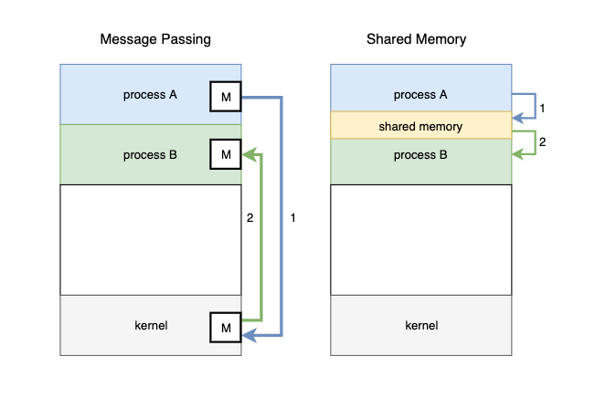
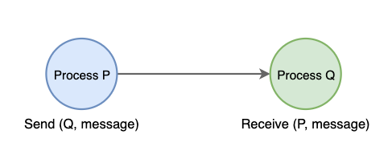
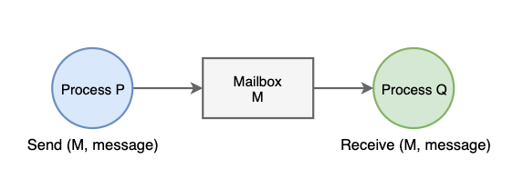
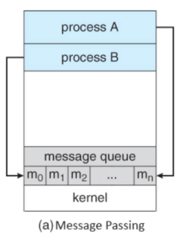
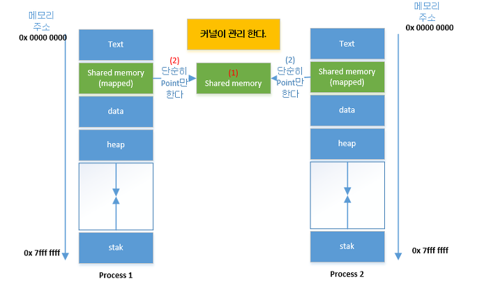

## IPC(Inter Process Communication)

- 정의

  - 프로세스간 통신

  - `프로세스 둘 사이에 서로 데이터를 주고받는 행위` ` 또는 그에 대한 방법 혹은 경로를 뜻함`

    ```
    process a - rss1
    process b - rss2
    process b가 process a의 rss1에 접근하려고 하면, memory protection에 의해 막히게 됨
    memory protection
    운영 체제에서 실행하고 있는 프로세스가 자신에게 할당되지 않은 영역의 메모리에 접근하는 것을 막는 것
    ```

- Message Passing - OS 

- Shared Memory - memory

  


1. Message Passing

- 기존에 형성되어 있던 커널을 거쳐, 메세지를 전달하는 방식으로 쉽게 구현할 수 있다.

- 커널 메모리 영역에 메시지 전달을 위한 채널을 만들어서 

  협력하는 프로세스들 사이에 메시지 형태로 정보를 Send/Receive 하는 방법

  - 장점
    - 커널(OS)에서 데이터의 주고받음을 컨트롤할 수 있다. (OS가 알아서 동기화 해줌) 
    - 별도의 동기화 로직이 없어도 된다.
    - 같은 파일을 전달하는데 있어서 conflict가 발생하지 않는다.
  - 단점
    - 커널을 통해서 데이터 주고받기 때문에 shared memory 모델보다 느리다.
    - 커널의 일부에 이를 저장하기 위한 공간이 필요하게 된다. 

  


- Direct Communication 
  - 통신하려는 프로세스의 이름을 명시적으로 표시하여 메시지를 직접 전달하는 방식
  - 커널에 메시지를 주고, 커널이 Q에게 메세지를 전달함



​						

- Indirect Communication
  - mailbox(또는 port)를 통해 메시지 간접 전달하는 방식
  - 커널의 메일박스에 넣어두면, Q가 읽어오는 방식
    - 단점: 번거롭고 오버헤드가 크다.

                                               

---

2. Shared Memory



- 커널에 생성된 공유 메모리를 통해 프로세스간 데이터를 공유한다.
  - 서로 다른 프로세스 간에 일부 주소 공간을 공유하여 데이터를 주고받는 방식
  - 공유 메모리영역을 통해 통신이 가능하다.
  - 단순히 공유 메모리를 point함으로써 프로세스에서 사용되는 메모리가 증가되지는 않는다.
  - 프로세스간 read, write를 모두 필요로 할때 사용된다.
- 장점
  - 메모리를 직접 접근하기 때문에 message passing 모델보다 속도가 빠르다.
- 단점
  - 프로세스 A가 공유 메모리에 데이터 전달해도 프로세스 B가 그것을 알 수 없다.
  - 별도의 동기화 기술 필요
  - 프로세스간의 메모리 크기가 동일해야 한다.

```
<사용>
(1)공유 메모리 공간을 가져온다. / 없을시 생성
(2)공유 메모리를 process와 연결시킨다.
   공유 메모리에 데이터를 쓴다.
```


정리

- 서로 다른 컴퓨터에 있는 두개의 프로세스가 통신하는 것
- 네트워크
- 두개의 프로세스가 네트워크로 연결


---

참고

[코드 및 추가설명](https://doitnow-man.tistory.com/110)

[링크](https://yoongrammer.tistory.com/56)

[링크](https://jhnyang.tistory.com/24)

https://jwprogramming.tistory.com/54

https://m.blog.naver.com/PostView.naver?isHttpsRedirect=true&blogId=akj61300&logNo=80130589983

https://www.byfuls.com/programming/read?id=63

youtube.com/watch?v=Bgdii8FppOU

---

프로세스가 동시 실행될때

- 독립적 프로세스
  - 다른프로세스에게 영향을 주거나 받을 수 없음
  - 데이터를 공유하지 않음
- 협력 프로세스
  - `프로세스간 통신 메커니즘(IPC) 가 필요!`
  - 다른 프로세스에 영향을 주거나 받을 수 있음
  - 데이터를 공유함
  - 장점
    - 정보공유: 사용자 간에 상태, 데이터를 주고받으며 정보 공유할 수 있음
    - 계산속도 향상: 여러 프로세스가 동시에 작업을 병렬로 처리하기 때문에 속도를 높일 수 있다.
    - 모듈성: 시스템 기능을 별도의 프로세스 또는 스레드로 분할하여 모듈 식 방식으로 시스템을 구성
    - 편의: 한번에 여러 작업를 수행할 수 있다.