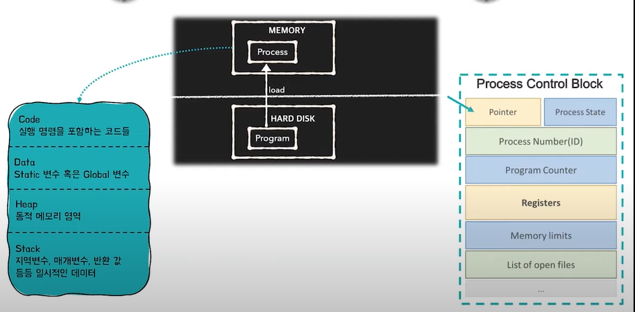

# [#](https://gyoogle.dev/blog/computer-science/operating-system/PCB & Context Switching.html#pcb-context-switching)PCB & Context Switching

------


프로세스 = 프로그램이 실행된 것

프로그램이 프로세스가 되면서 , 프로세스가 필요로 하는 것들이 메모리에 올라가야함



1. stack, geapp...영역 등이 메모리 공간을 확보하면서 올라감
2. pcb 블럭생성 (Process Control Block)

```
코드 프로그램을 실행시켜야 하는데-> 이게 프로세스가 됨

(즉, 웹서핑, 다운로드 등 여러 작업을 한번에 할때) = 여러개의 프로세스를 사용(동시, 병렬적)

동시성: 프로세스하나가 여러작업을 돌아가면서 일부분씩 진행

		이렇게 진행중인 작업을 바꾸는것 = contextswitching  ##
--------------------------------------------------------------------------------------------
병렬적: 프로세서 하나에 코어 여러개가 달려, 각각 동시에 작업을 수행함

		(듀얼코어,,쿼드 옥타... 등) 멀티코어 프로세서가 달린 컴퓨터에서 할 수 있음

		cpu가 발열때문에 더 발전을 못하자, 코어 여러개를 넣음

한 프로세스 안에서 여러갈래의 작업들이 동시에 진행될 수 있어야함(이 갈래를 스레드라고 함)
```


### [#](https://gyoogle.dev/blog/computer-science/operating-system/PCB & Context Switching.html#process-management)Process Management

> CPU가 프로세스가 여러개일 때, CPU 스케줄링을 통해 관리하는 것을 말함

이때, CPU는 각 프로세스들이 누군지 알아야 관리가 가능함

프로세스들의 특징을 갖고있는 것이 바로 `Process Metadata`

- #### [#](https://gyoogle.dev/blog/computer-science/operating-system/PCB & Context Switching.html#process-metadata)Process Metadata (프로세스가 생성되면 `PCB(Process Control Block)`에 저장됨)

  - Process ID
  - Process State
  - Process Priority
  - CPU Registers
  - Owner
  - CPU Usage
  - Memeory Usage


### [#](https://gyoogle.dev/blog/computer-science/operating-system/PCB & Context Switching.html#pcb-process-control-block)PCB(Process Control Block)

> 프로세스 메타데이터들을 저장해 놓는 곳, 한 PCB 안에는 한 프로세스의 정보가 담김


#### [#](https://gyoogle.dev/blog/computer-science/operating-system/PCB & Context Switching.html#다시-정리해보면)다시 정리해보면?

```text
프로그램 실행 → 프로세스 생성 → 프로세스 주소 공간에 (코드, 데이터, 스택) 생성 
→ 이 프로세스의 메타데이터들이 PCB에 저장
```


#### [#](https://gyoogle.dev/blog/computer-science/operating-system/PCB & Context Switching.html#pcb는-어떻게-관리되나요)PCB는 어떻게 관리되나요?

Linked List 방식으로 관리된다.

PCB List Head에 PCB들이 생성될 때마다 붙게 된다. 주소값으로 연결이 이루어져 있는 연결리스트이기 때문에 삽입 삭제가 용이하다.

즉, 프로세스가 생성되면 해당 PCB가 생성되고 프로세스 완료시 제거된다.


#### [#](https://gyoogle.dev/blog/computer-science/operating-system/PCB & Context Switching.html#pcb가-왜-필요한가요)PCB가 왜 필요한가요? 

(동시에 실행하려는 프로세스가 두개 있을때)

CPU에서는 프로세스의 상태에 따라 교체작업이 이루어진다. 

(interrupt가 발생해서 할당받은 프로세스가 wating 상태가 되고 다른 프로세스를 running으로 바꿔 올릴 때)

이때, **앞으로 다시 수행할 대기 중인 프로세스에 관한 저장 값을 PCB에 저장해두는 것**이다. 

이렇게 수행 중인 프로세스를 변경할 때, CPU의 레지스터 정보가 변경되는 것을 `Context Switching`이라고 한다.


### [#](https://gyoogle.dev/blog/computer-science/operating-system/PCB & Context Switching.html#context-switching)Context Switching

> CPU가 이전의 프로세스 상태를 PCB에 보관하고, 
>
> 또 다른 프로세스의 정보를 PCB에 읽어 레지스터에 적재하는 과정

보통 인터럽트가 발생하거나, 실행 중인 CPU 사용 허가시간을 모두 소모하거나, 입출력을 위해 대기해야 하는 경우에 Context Switching이 발생한다.

```
즉, 프로세스가 Ready → Running, Running → Ready, Running → Waiting처럼 상태 변경 시 발생!
```


#### [#](https://gyoogle.dev/blog/computer-science/operating-system/PCB & Context Switching.html#context-switching의-overhead란)Context Switching의 OverHead란?

overhead는 과부하라는 뜻으로 보통 안좋은 말로 많이 쓰인다.

하지만 프로세스 작업 중에는 OverHead를 감수해야 하는 상황이 있다.

```text
프로세스를 수행하다가 입출력 이벤트가 발생해서 대기 상태로 전환시킴
이때, CPU를 그냥 놀게 놔두는 것보다 다른 프로세스를 수행시키는 것이 효율적
```

즉, CPU에 계속 프로세스를 수행시키도록 하기 위해서 다른 프로세스를 실행시키고 Context Switching 하는 것

CPU가 놀지 않도록 만들고, 사용자에게 빠르게 일처리를 제공해주기 위한 것이다.

---

참고

https://gyoogle.dev/blog/computer-science/operating-system/PCB%20&%20Context%20Switching.html

https://www.youtube.com/watch?v=1grtWKqTn50

---

```
코드 프로그램을 실행시켜야 하는데-> 이게 프로세스가 됨

(즉, 웹서핑, 다운로드 등 여러 작업을 한번에 할때) = 여러개의 프로세스를 사용(동시, 병렬적)

동시성: 프로세스하나가 여러작업을 돌아가면서 일부분씩 진행

		이렇게 진행중인 작업을 바꾸는것 = contextswitching  ##
--------------------------------------------------------------------------------------------
병렬적: 프로세서 하나에 코어 여러개가 달려, 각각 동시에 작업을 수행함

		(듀얼코어,,쿼드 옥타... 등) 멀티코어 프로세서가 달린 컴퓨터에서 할 수 있음

		cpu가 발열때문에 더 발전을 못하자, 코어 여러개를 넣음

한 프로세스 안에서 여러갈래의 작업들이 동시에 진행될 수 있어야함(이 갈래를 스레드라고 함)
```


멀티코어는 하드웨어 측면에 가까움