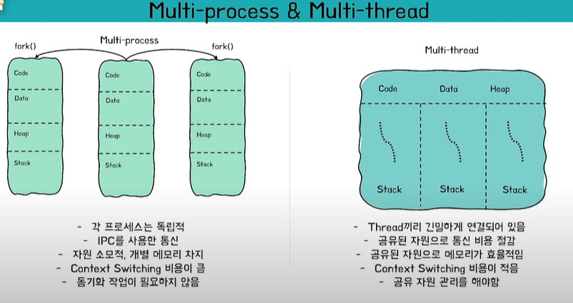

# 프로세스 & 스레드

------


> **프로세스** : 프로그램을 메모리 상에서 실행중인 작업
>
> **스레드** : 프로세스 안에서 실행되는 여러 흐름 단위


기본적으로 프로세스마다 최소 1개의 스레드 소유 (메인 스레드 포함)


#### [#](https://gyoogle.dev/blog/computer-science/operating-system/Process vs Thread.html#프로세스는-각각-별도의-주소공간-할당-독립적)프로세스는 각각 별도의 주소공간 할당 (독립적)

- **Code** : 코드 자체를 구성하는 메모리 영역(프로그램 명령)
- **Data** : 전역변수, 정적변수, 배열 등
  - 초기화 된 데이터는 data 영역에 저장
  - 초기화 되지 않은 데이터는 bss 영역에 저장
- **Heap** : 동적 할당 시 사용 (new(), malloc() 등)
- **Stack** : 지역변수, 매개변수, 리턴 값 (임시 메모리 영역)


스레드는 Stack만 따로 할당 받고 나머지 영역은 서로 공유

하나의 프로세스가 생성될 때, 기본적으로 하나의 스레드 같이 생성

**프로세스는 자신만의 고유 공간과 자원을 할당받아 사용**하는데 반해, **스레드는 다른 스레드와 공간, 자원을 공유하면서 사용**하는 차이가 존재함


---

한 어플리케이션에 대한 두가지 다른 `처리방식`에 대한 이야기 (소프트웨어적 측면)

`멀티 프로세스`

ex) 여러 사용자가 로그인

부모프로세스를 fork()해서 자식 프로세스가 별개의 메모리 영역을 가지고 처리하도록 함


`멀티스레드`

한 어플에대한 작업의 단위가 나뉘어질때, 각 스레드가 작업을 담당

스레드: 한 프로세스 내에서 구분지어진 실행단위

(실행단위 = 프로세스 또는 스레드, 즉 만일 프로세스가 다수의 스레드로 구성되어있지 않으면 단일 스레드 하나로 프로세스가 실행됨)



ex) 

멀티 프로세스; 구글크롬(멀티탭 영향 덜받음)

멀티 스레드; 인터넷익스플로어(탭하나에 문제가 생겼을때, 전체에 영향을 미침)

---


#### [#](https://gyoogle.dev/blog/computer-science/operating-system/Process vs Thread.html#멀티프로세스)멀티프로세스

> 하나의 컴퓨터에 여러 CPU 장착 → 하나 이상의 프로세스들을 동시에 처리(병렬)

**장점** : 안전성 (메모리 침범 문제를 OS 차원에서 해결)

**단점** : 각각 독립된 메모리 영역을 갖고 있어, 작업량 많을 수록 오버헤드 발생. Context Switching으로 인한 성능 저하


***Context Switching\*이란?**

프로세스의 상태 정보를 저장하고 복원하는 일련의 과정

즉, 동작 중인 프로세스가 대기하면서 해당 프로세스의 상태를 보관하고, 대기하고 있던 다음 순번의 프로세스가 동작하면서 이전에 보관했던 프로세스 상태를 복구하는 과정을 말함

→ 프로세스는 각 독립된 메모리 영역을 할당받아 사용되므로, 캐시 메모리 초기화와 같은 무거운 작업이 진행되었을 때 오버헤드가 발생할 문제가 존재함


#### [#](https://gyoogle.dev/blog/computer-science/operating-system/Process vs Thread.html#멀티-스레드)멀티 스레드

> 하나의 응용 프로그램에서 여러 스레드를 구성해 각 스레드가 하나의 작업을 처리하는 것

스레드들이 공유 메모리를 통해 다수의 작업을 동시에 처리하도록 해줌


**장점** : 독립적인 프로세스에 비해 공유 메모리만큼의 시간, 자원 손실이 감소 전역 변수와 정적 변수에 대한 자료 공유 가능

**단점** : 안전성 문제. 긴밀하게 연결되어, 하나의 스레드가 데이터 공간 망가뜨리면, 모든 스레드가 작동 불능 상태 (공유 메모리를 갖기 때문)

- 멀티스레드의 안전성에 대한 단점은 Critical Section 기법을 통해 대비함

  하나의 스레드가 공유 데이터 값을 변경하는 시점에 다른 스레드가 그 값을 읽으려할 때 발생하는 문제를 해결하기 위한 동기화 과정

  ```text
  상호 배제, 진행, 한정된 대기를 충족해야함
  ```

---

참고

https://gyoogle.dev/blog/computer-science/operating-system/Process%20vs%20Thread.html

https://www.youtube.com/watch?v=1grtWKqTn50