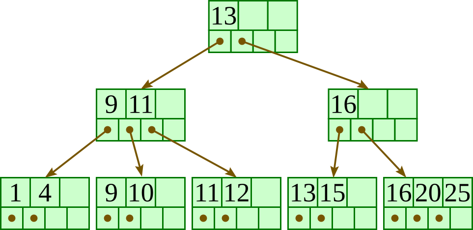
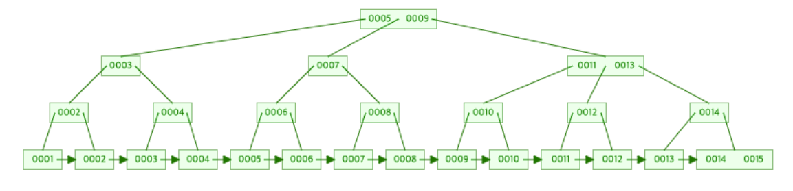

# B Tree & B+ Tree (Balanced)

------

> **이진 트리**는 하나의 부모가 두 개의 자식밖에 가지질 못하고, 균형이 맞지 않으면 검색 효율이 선형검색 급으로 떨어진다. 하지만 이진 트리 구조의 간결함과 균형만 맞다면 검색, 삽입, 삭제 모두 O(logN)의 성능을 보이는 장점이 있기 때문에 계속 개선시키기 위한 노력이 이루어지고 있다.




- 하나의 노드에 여러 자료가 배치되는 트리구조

- 한 노드에 m개의 자료 배치시 m차 btree  /3차 (최대 3차라는 것, 항상 차 있진 않음)

- m의 짝, 홀에 따라 알고리즘이 다름

  

### [#](https://gyoogle.dev/blog/computer-science/data-structure/B Tree & B+ Tree.html#b-tree)B Tree

------

데이터베이스, 파일 시스템에서 널리 사용되는 트리 자료구조의 일종이다.

이진 트리를 확장해서, 더 많은 수의 자식을 가질 수 있게 일반화 시킨 것이 B-Tree


자식 수에 대한 일반화를 진행하면서, 하나의 레벨에 더 저장되는 것 뿐만 아니라 트리의 균형을 자동으로 맞춰주는 로직까지 갖추었다. 단순하고 효율적이며, 레벨로만 따지면 완전히 균형을 맞춘 트리다.

```text
대량의 데이터를 처리해야 할 때, 검색 구조의 경우 하나의 노드에 많은 데이터를 가질 수 있다는 점은 상당히 큰 장점이다.

대량의 데이터는 메모리보다 블럭 단위로 입출력하는 하드디스크 or SSD에 저장해야하기 때문!

ex) 한 블럭이 1024 바이트면, 2바이트를 읽으나 1024바이트를 읽으나 똑같은 입출력 비용 발생. 따라서 하나의 노드를 모두 1024바이트로 꽉 채워서 조절할 수 있으면 입출력에 있어서 효율적인 구성을 갖출 수 있다.

→ B-Tree는 이러한 장점을 토대로 많은 데이터베이스 시스템의 인덱스 저장 방법으로 애용하고 있음
```


#### [#](https://gyoogle.dev/blog/computer-science/data-structure/B Tree & B+ Tree.html#규칙)규칙

- 노드의 자료수가 N이면, 자식 수는 N+1이어야 함

- 각 노드의 자료는 정렬된 상태여야함

- 루트 노드는 적어도 2개 이상의 자식을 가져야함

- 노드의 서브트리의 왼쪽은 작은값, 오른쪽은 큰 값이 위치해야함

  

- 루트 노드를 제외한 모든 노드는 적어도 M/2개의 자료를 가지고 있어야함

  - 5/2 =2개 이상의 자료

- 외부 노드로 가는 경로의 길이는 모두 같음.**

- 입력 자료는 중복 될 수 없음


### [#](https://gyoogle.dev/blog/computer-science/data-structure/B Tree & B+ Tree.html#b-tree-2)B+ Tree

------

데이터의 빠른 접근을 위한 인덱스 역할만 하는 비단말 노드(not Leaf)가 추가로 있음

(기존의 B-Tree와 데이터의 연결리스트로 구현된 색인구조)



```
차이점: 데이터 주소가 각 노드별로 저장된 것이 아니라 마지막 리프 노드에만 저장되어 있음
브랜치와 루트 노드는 데이터 주소 값을 저장하지 않고, 다음 자식 노드의 페이지 값만 가지고 있음
( 한정된 노드 크기에서 B-Tree보다 상대적으로 깊이가 낮다. )
리프 노드의 경우 각각의 노드들이 연결 리스트로 정렬되어 있어 순차 접근 시 B-Tree 보다 빠르게 데이터에 접근 할 수 있음
```

만약 찾는 데이터 값이 루트 노드에 위치해 있을 경우 B-Tree는 바로 데이터에 접근 할 수 있지만, 

B+Tree의 경우 리프 노드까지 접근해야 해당 데이터 값을 호출 할 수 있다.


---

---


#### [#](https://gyoogle.dev/blog/computer-science/data-structure/B Tree & B+ Tree.html#장점)장점

블럭 사이즈를 더 많이 이용할 수 있음 (key 값에 대한 하드디스크 액세스 주소가 없기 때문)

leaf 노드끼리 연결 리스트로 연결되어 있어서 범위 탐색에 매우 유리함

검색하고자 하는 데이터의 크기와 상관없이 균등한 검색속도를 제공함 

```
[4, 8, 11, 13 ... 80, 88, 89, 98] 
순차적으로 해당 데이터를 검색한다면 숫자가 작은 13이 상대적으로 98보다 빠르게 검색될 수 있기 때문에 속도차이가 난다.
하지만 B-Tree의 경우 동일한 깊이에 데이터가 위치하여 균등한 검색 속도 결과를 제공한다.
+ 저장되어 있는 데이터가 늘어나도 검색 시간이 크게 증가하지 않는다.
```


#### [#](https://gyoogle.dev/blog/computer-science/data-structure/B Tree & B+ Tree.html#단점)단점

B-Tree는 검색 속도가 빠르지만, 순차적으로 데이터를 불러오는 경우 리프, 브랜치, 루트 노드에 각각 저장된 데이터 주소를 불러와야 하기 때문에 매우 복잡함

B-tree의 경우 최상 케이스에서는 루트에서 끝날 수 있지만, B+tree는 무조건 leaf 노드까지 내려가봐야 함


\# 활용


```
MySQL에서 DB에 저장된 데이터를 빠르게 불러오기 위해 인덱스와 데이터 파일을 따로 관리함.
인덱스는 테이블에서 원하는 데이터를 빠르게 갖고오기 위해 사용되며 해당 목적을 달성시키기 위해 B-Tree구조로 관리

즉, 인덱스를 따로 관리해 데이터의 크기나 양에 상관없이 일관된 속도를 보장해주고 
빠르게 결과를 추출하기 위해 사용됩니다.
```

- mysql = 데이터베이스
  - 창고/ 운반/ 물건
  - mysql/ sql/ data

- 장고 orm (파이썬을 가져와서 sql 코드로 바꿔주는 일)

  


#### [#](https://gyoogle.dev/blog/computer-science/data-structure/B Tree & B+ Tree.html#b-tree-b-tree-2)B-Tree & B+ Tree

B-tree는 각 노드에 데이터가 저장됨

B+tree는 index 노드와 leaf 노드로 분리되어 저장됨

(또한, leaf 노드는 서로 연결되어 있어서 임의접근이나 순차접근 모두 성능이 우수함)


B-tree는 각 노드에서 key와 data 모두 들어갈 수 있고, data는 disk block으로 포인터가 될 수 있음

B+tree는 각 노드에서 key만 들어감. 따라서 data는 모두 leaf 노드에만 존재

B+tree는 add와 delete가 모두 leaf 노드에서만 이루어짐


---

참고

- [링크](https://wangin9.tistory.com/entry/B-tree-B-tree)

- [tech interview](https://gyoogle.dev/blog/computer-science/data-structure/B%20Tree%20&%20B+%20Tree.html)

- [btree](https://velog.io/@emplam27/%EC%9E%90%EB%A3%8C%EA%B5%AC%EC%A1%B0-%EA%B7%B8%EB%A6%BC%EC%9C%BC%EB%A1%9C-%EC%95%8C%EC%95%84%EB%B3%B4%EB%8A%94-B-Tree)

- https://naming0617.tistory.com/35

- https://naming0617.tistory.com/36
- https://fierycoding.tistory.com/78