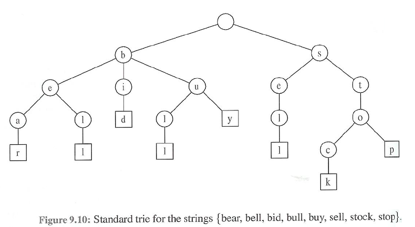

## 트라이

> 문자열에서 검색을 빠르게 도와주는 자료구조

```
정수형에서 이진탐색트리를 이용하면 시간복잡도 O(logN)
하지만 문자열에서 적용했을 때, 문자열 최대 길이가 M이면 O(M*logN)이 된다.

트라이를 활용하면? → O(M)으로 문자열 검색이 가능함!
```


하위 노드로 갈 때마다 검색량이 절반 줄어들기 때문에, 노드의 개수를 n이라고 했을 때 ;; 시간복잡도 : O(logn)



- 트리의 문자가 세로로 저장이 됨
- 똑같은 문자로 시작하는게 아니므로, 루트노드는 비워줌
- M 이 문자열의 최대 길이라고 할 때, O(M)의 시간이 걸리게 됨

>예시 그림에서 주어지는 배열의 총 문자열 개수는 8개인데, 트라이를 활용한 트리에서도 마지막 끝나는 노드마다 '네모' 모양으로 구성된 것을 확인하면 총 8개다.

```
실무에서 유용하게 쓰임, 자연어 처리(NLP)분야에서 문자열 탐색을 위한 자료구조로 쓰임
알고리즘 문제; ex) 포털에서 이용되는 문자 자동완성 기능 구현
인기 검색어, 텍스트 자동완성, 언어변역, 시리
```


---

문제: [전화번호 목록](https://www.acmicpc.net/problem/5052)

 [리트코드](https://leetcode.com/)의 208


```python
import collections

class TrieNode:
    def __init__(self):
        self.word = False
        self.children = collections.defaultdict(TrieNode)

class Trie:

    def __init__(self):
        """
        Initialize your data structure here.
        """
        self.root = TrieNode()

    def insert(self, word: str) -> None:
        """
        Inserts a word into the trie.
        """
        node = self.root
        for char in word:
            node = node.children[char]
        node.word = True

    def search(self, word: str) -> bool:
        """
        Returns if the word is in the trie.
        """
        node = self.root
        for char in word:
            if char not in node.children:
                return False
            node = node.children[char]
        return node.word

    def startsWith(self, prefix: str) -> bool:
        """
        Returns if there is any word in the trie that starts with the given prefix.
        """
        node = self.root
        for char in prefix:
            if char not in node.children:
                return False
            node = node.children[char]
        return True
```

---

참고

- https://gyoogle.dev/blog/computer-science/data-structure/Trie.html

- https://www.youtube.com/watch?v=TohdsR58i3Q

- [알고리즘](https://velog.io/@dksgyals1/%ED%8A%B8%EB%9D%BC%EC%9D%B4Trie-%EC%9E%90%EB%A3%8C%EA%B5%AC%EC%A1%B0)